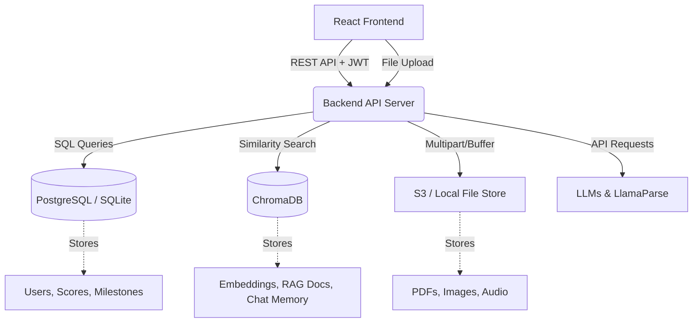

# EduAgent: Full-Stack Architecture & Implementation Plan

Currently, EduAgent is a frontend-only React application using browser-based local storage and direct API calls to LLMs. To support user accounts, persistent memory, and document retrieval, the architecture must evolve into a **Full-Stack Application**. 

This plan outlines the implementation of a new backend service and the integration of the four requested pillars.

---

## Phase 1: Authentication & User Interface (Frontend + Auth)
Before databases can be tied to a specific student, the application needs an identity concept.

### 1.1 UI Implementation (React)
- **Routes:** Create `/login` and `/signup` routes using `react-router-dom`.
- **Components:** Design clean, accessible forms taking Email & Password.
- **State Management:** Implement an `AuthContext` to store the active user session JWT token and user profile globally.
- **Route Protection:** Wrap the `/dashboard` and milestone routes in a `<ProtectedRoute>` component that redirects unauthenticated users to `/login`.

### 1.2 Authentication Strategy
- **Option A (Self-hosted JWT):** The upcoming backend will generate JSON Web Tokens (JWT) upon successful login. The React frontend will store these in HTTP-only cookies or `localStorage` to attach to API requests.
- **Option B (Managed Service - Recommended):** Use a service like **Supabase**, **Firebase Auth**, or **Clerk** to handle password hashing, social logins, and token generation safely out-of-the-box.

---

## Phase 2: Relational Database (Structured Data)
Transitioning from browser `localStorage` to a persistent, queried database. 

### 2.1 Backend API Initialization
- Set up a Node.js/Express (or Python/FastAPI) backend. 
- Move all direct LLM API calls (Gemini, LlamaParse) from the React frontend to backend controller routes to secure the API keys.

### 2.2 Database Selection & ORM
- **Database:** Start with **SQLite** for rapid local development, but use an ORM so transitioning to production **PostgreSQL** requires zero code changes.
- **ORM:** Use **Prisma** (if Node.js) or **SQLAlchemy** (if Python).

### 2.3 Schema Design
- **`users` table:** `id`, `email`, `password_hash`, `created_at`
- **`learning_paths` table:** `id`, `user_id`, `topic`, `status`
- **`milestones` table:** `id`, `path_id`, `title`, `content`, `progress_score`
- **`quiz_scores` table:** Tracks performance on specific milestone quizzes over time.

---

## Phase 3: Vector Database (Semantic Memory)
Enabling the AI to "remember" previous conversations and perform Retrieval-Augmented Generation (RAG) on uploaded documents.

### 3.1 Vector Store Integration
- **Database:** Deploy **ChromaDB** locally (via Docker) or use a managed service like Pinecone/Weaviate. 
- **Embeddings Model:** Use Gemini or OpenAI embedding models (e.g., `text-embedding-3-small`) to convert user text and pdf chunks into vectors.

### 3.2 Semantic Workflows
- **Memory:** Every time a user asks a question in the Doubt Chat, embed the Q&A text and insert it into ChromaDB tagged with the `user_id`.
- **Context Injection:** When a user asks a new question, query ChromaDB for the top 3 most semantically similar past interactions and inject them into the LLM system prompt.
- **Document RAG:** When LlamaParse parses a large PDF, chunk the markdown, embed it, and store it in ChromaDB so the AI can search through massive textbooks instantly.

---

## Phase 4: File Store (Binary Content)
Storing actual user-uploaded documents securely so they can be referenced or parsed later.

### 4.1 Storage Architecture
- **Local Dev:** Use the local backend filesystem (e.g., an `/uploads` directory served statically) using a library like `multer`.
- **Production:** Implement an **AWS S3** bucket (or Cloudflare R2 / Supabase Storage). 

### 4.2 Workflow
1. User attaches a PDF in the React frontend.
2. Frontend sends the file via `FormData` to a backend `/upload` endpoint.
3. Backend uploads the binary payload to the File Store (S3).
4. Backend retrieves a unique URL (or S3 Key).
5. Backend invokes LlamaParse using the S3 file (or passes the buffer directly), then stores the parsed text chunks in ChromaDB.
6. A reference to the file URL is saved in the PostgreSQL `attachments` table linked to the user.

---

## Summary of New Architecture

